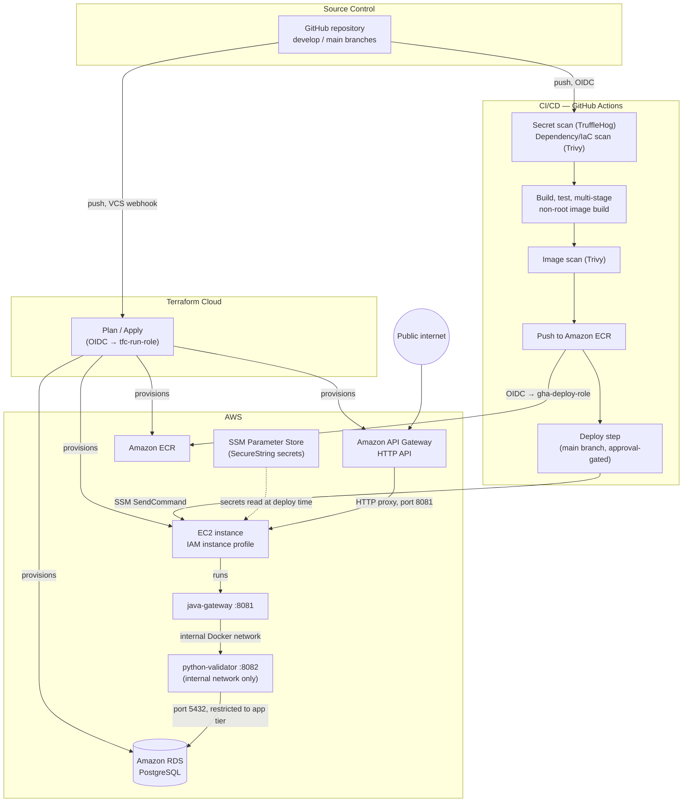

# OIDC-Secured DevOps Reference Pipeline

A two-service reference implementation demonstrating a production-style DevOps pipeline: hardened multi-stage containers, dependency and secret scanning in CI, credential-free (OIDC-based) authentication between GitHub Actions / Terraform Cloud and AWS, Infrastructure-as-Code provisioning, and a gated deployment path — with no long-lived AWS access keys stored anywhere in the system.

## What this demonstrates

- **Zero standing cloud credentials.** No AWS access key is stored in GitHub, in Terraform Cloud, or on any developer machine. All CI/CD and infrastructure-provisioning authentication uses short-lived OIDC-issued tokens.
- **Defense-in-depth container hardening.** Multi-stage Docker builds, non-root container users, and image vulnerability scanning (Trivy) as a CI gate.
- **Infrastructure as Code.** All AWS resources (networking, compute, database, container registry, API gateway, IAM) are defined in Terraform and applied through Terraform Cloud.
- **Secrets management.** Database and API credentials are generated by Terraform and stored in AWS Systems Manager Parameter Store (`SecureString`), never committed to version control or hardcoded in container configuration.
- **Automated, approval-gated CI/CD.** GitHub Actions runs secret scanning, dependency scanning, build/test, image scanning, and a production deployment step that requires manual approval.

## System components

| Component | Technology | Role |
|---|---|---|
| `01-java-ingestion-service` | Java 21, Spring Boot | Public-facing ingestion gateway; validates and forwards payloads |
| `02-python-transformation-api` | Python 3.14, FastAPI | Internal transformation service; persists processed records |
| Database | PostgreSQL 16 | Data store (containerized in local development; Amazon RDS in the deployed environment) |

## Architecture



Full design rationale — why each of these choices was made — is documented in [`docs/ARCHITECTURE.md`](docs/ARCHITECTURE.md). Step-by-step deployment instructions are in [`docs/DEPLOYMENT.md`](docs/DEPLOYMENT.md).

## Local quickstart

Requires Docker and Docker Compose. No AWS account is needed for this path — it verifies the application layer independently of the cloud deployment. `docker-compose.dev.yml` builds the application images from source and includes a containerized PostgreSQL instance; it is distinct from `infra/docker-compose.prod.yml`, used only by the deployed AWS environment (see [`docs/DEPLOYMENT.md`](docs/DEPLOYMENT.md)).

```bash
# Run from the repository root
git clone https://github.com/<GITHUB_ORG>/<REPO_NAME>.git
cd <REPO_NAME>

docker compose -f docker-compose.dev.yml up --build -d
docker compose -f docker-compose.dev.yml ps               # all three services should report "healthy" or "running"

curl http://localhost:8081/health
curl -X POST http://localhost:8081/api/v1/ingest/bulk \
  -H "Content-Type: application/json" \
  -d '{"meter_id":"MTR-000123","grid_zone":"ZONE-A","readings":[{"timestamp":"2026-01-01T00:00:00Z","kwh_value":12.5}]}'
```

```powershell
# PowerShell equivalent
git clone https://github.com/<GITHUB_ORG>/<REPO_NAME>.git
cd <REPO_NAME>

docker compose -f docker-compose.dev.yml up --build -d
docker compose -f docker-compose.dev.yml ps

Invoke-RestMethod -Uri http://localhost:8081/health
Invoke-RestMethod -Uri http://localhost:8081/api/v1/ingest/bulk -Method Post -ContentType "application/json" `
  -Body '{"meter_id":"MTR-000123","grid_zone":"ZONE-A","readings":[{"timestamp":"2026-01-01T00:00:00Z","kwh_value":12.5}]}'
```

## Repository status

| Area | Status |
|---|---|
| Dependency freeze, Python 3.14 migration | Implemented |
| Git hygiene, container hardening (multi-stage, non-root, healthchecks) | Implemented |
| Identity/access bootstrap, AWS provisioning, CI/CD, deployment | See [`docs/DEPLOYMENT.md`](docs/DEPLOYMENT.md) |

## Documentation

- [`docs/ARCHITECTURE.md`](docs/ARCHITECTURE.md) — design principles, audit findings that shaped the design, and the identity/security model
- [`docs/DEPLOYMENT.md`](docs/DEPLOYMENT.md) — instructions to deploy this project to an independent AWS account
