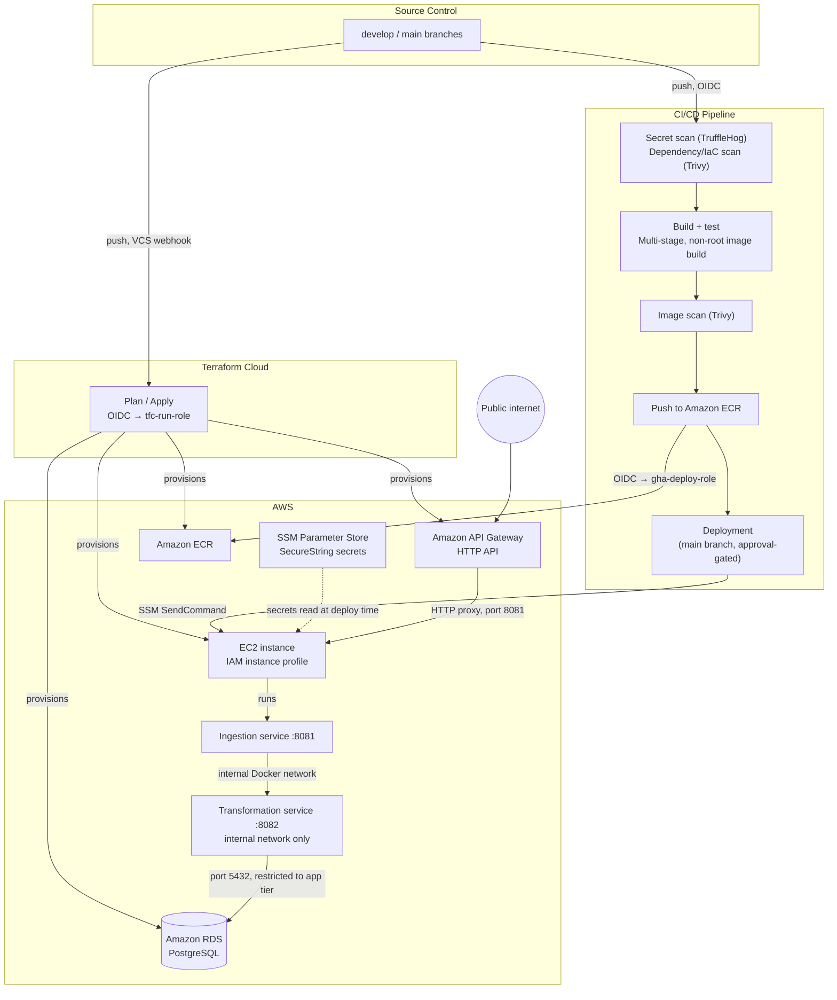
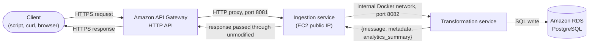

# Architecture and Design Rationale

This document explains why the system is built the way it is. It does not contain execution instructions — for those, see [`DEPLOYMENT.md`](DEPLOYMENT.md). No AWS account, GitHub access, or command execution is required to read this document.

---

## 1. Design Principles

1. **CI/CD performs all deployment actions.** A push to `develop`/`main` is the sole manual trigger for application changes.
2. **No long-lived AWS credentials are used at any point.** GitHub Actions and Terraform Cloud authenticate to AWS exclusively via OIDC; no static access key is stored in GitHub Secrets or Terraform Cloud variables. The one step that cannot be performed via OIDC — establishing the initial OIDC trust — uses `aws login`, a browser-based console-credential flow (AWS CLI ≥ 2.32.0) that issues short-lived credentials without creating a static access key. This mechanism is distinct from IAM Identity Center; AWS documentation directs Identity Center users to `aws sso login` instead.
3. **IAM Identity Center is not used**, consistent with the constraint in Principle 2.
4. **Free-tier eligibility is time-bound.** RDS and API Gateway free-tier allowances expire at the end of an account's 12-month window; resources dependent on this are flagged at their point of definition in `DEPLOYMENT.md`.
5. **Every specification is grounded in the actual codebase** — exact file paths, property names, ports, and Terraform resource names are used rather than illustrative placeholders, except where a document is explicitly intended for reuse by a third party (see `DEPLOYMENT.md`'s placeholder convention).
6. **This repository is a standalone, independently deployable implementation.** It assumes no shared Git repository, VS Code workspace, GitHub organization, Terraform Cloud organization, or resource-naming namespace with any other cloud implementation of this reference project. A person deploying this repository alongside a differently-clouded implementation of the same project is responsible for choosing distinct repository, workspace, and identity names between the two — this document does not assume that responsibility is handled for them.

---

## 2. Key Architecture Decisions

| Decision | Rationale |
|---|---|
| EC2 access is provided exclusively through AWS Systems Manager Session Manager; no SSH port is open and no SSH key pair exists. | Session Manager authorizes access through IAM rather than a network-exposed port or a private key file that could be lost or leaked — this removes an entire class of exposure rather than merely restricting it. |
| Database and API credentials are generated by Terraform and stored in AWS Systems Manager Parameter Store as `SecureString` values, read by the EC2 instance's own IAM role at deploy time. | No secret is ever committed to version control or hardcoded in a container configuration file. The application containers themselves hold no AWS credential and make no AWS API call — the effective permission set available to a compromised container is null (Appendix A.4). |
| The transformation service's port (8082) is not exposed to the public internet in the deployed environment. | It is called only by the ingestion service, over the internal Docker network. Exposing it externally would add attack surface with no corresponding benefit. |
| The GitHub Actions OIDC trust policy matches multiple `sub` claim shapes simultaneously, rather than a single assumed shape. | GitHub issues differently-shaped tokens depending on repository creation date (an immutable subject-claim format is automatic for repositories created since 2026-07-15) and job configuration (a job declaring `environment:` receives a claim shaped `repo:OWNER/REPO:environment:NAME`, not the `ref:refs/heads/BRANCH` shape a plain push-triggered job receives). Matching every shape a legitimate workflow run could produce avoids a class of authentication failure that produces no informative error on its own. |
| Compute is a single EC2 instance running Docker Compose, and the database is a single-AZ RDS instance, rather than ECS/Fargate or a Multi-AZ deployment. | Keeps the deployment within AWS Free Tier. Section 4 documents the upgrade path for each — neither requires a redesign, only a resource-level change. |

---

## 3. Target Architecture

Two structural changes from the pre-DevOps implementation: PostgreSQL moves from a container on the compute instance to a managed RDS instance, and API Gateway becomes the public entry point rather than direct exposure of the compute instance's application port. The security group continues to permit direct access during the transition; this scoping limitation and its resolution are documented in `DEPLOYMENT.md`, Section on API Gateway.

### Request flow: a single ingestion call

The diagram above shows how the system is deployed; this shows what happens when it is actually used — a single call to the ingestion endpoint, end to end:

The response body a client receives is the transformation service's response shape exactly as returned — the ingestion service does not reshape it. This is a deliberate simplicity choice for this project's scope: the ingestion service's role is authentication, validation, and routing, not response transformation.

---

## 4. Excluded Scope and Future Extensions

- **AWS Fargate / ECS** — excluded as not free-tier eligible in this deployment. When introduced, the existing container images require only a task definition and service configuration; no image rebuild is necessary.
- **VPC Link and Network Load Balancer** — required to remove the compute instance's public port exposure entirely. This is the direct successor to the HTTP proxy integration used in this phase.
- **Multi-AZ RDS / read replicas** — a `multi_az = true` toggle on the existing database resource; no redesign required.

---

## Appendix A — Identity, Security, and Terraform Cloud Reference

### A.1 Terraform Cloud: two distinct authentication layers

| Layer | Function | Mechanism | Configuration location |
|---|---|---|---|
| 1. Trigger authority → Terraform Cloud | Determines who may initiate a plan/apply run in the workspace | VCS integration (a push triggers a run automatically, no separate credential) or CLI-driven (`terraform login` stores a personal API token) | Terraform Cloud organization VCS settings, or local `~/.terraform.d/credentials.tfrc.json` |
| 2. Terraform Cloud → AWS | Determines what AWS credentials the executing run uses | Dynamic provider credentials (OIDC): a short-lived identity token is exchanged for temporary credentials scoped to a designated IAM role | Workspace environment variables `TFC_AWS_PROVIDER_AUTH` / `TFC_AWS_RUN_ROLE_ARN` |

**This project's deployed configuration does not use either layer.** The workspace's Execution Mode is set to Local (`DEPLOYMENT.md`, Section 1.2): every `terraform apply` runs directly from the operator's own machine, authenticated by `aws login`, with Terraform Cloud used solely as the remote state backend. The table above documents the alternative — VCS-triggered runs with OIDC dynamic credentials — as the mechanism this project's design intentionally avoided, given the added setup surface (a Terraform Cloud VCS connection, itself another integration that can silently fail to authorize) for a single-operator, free-tier-scale deployment. It remains a legitimate path for a team-operated or CI-driven infrastructure pipeline.

### A.2 Identity inventory

| Identity | Type | Credential mechanism | Lifespan | Permissions | Consumer |
|---|---|---|---|---|---|
| Bootstrap user | IAM user | `aws login` (browser OAuth+PKCE); no access key is created | One session, capped at 12 hours | Broad, attached directly for this one-time step | Identity-bootstrap Terraform configuration, and optionally subsequent local iteration |
| CI deployment role | IAM role | GitHub Actions OIDC (`token.actions.githubusercontent.com`) | Duration of one workflow job | Container registry push (named repositories only); `ssm:SendCommand`/`ssm:GetCommandInvocation`, restricted to the tagged compute instance | CI build/push and deploy jobs |
| Terraform Cloud run role | IAM role | Terraform Cloud OIDC (`app.terraform.io`) | Duration of one plan/apply run | Provisioning permissions for networking, compute, database, container registry, IAM (policy attachment for the two roles listed here), API gateway, and parameter store | Every remote `terraform apply` |
| EC2 instance role | IAM role, attached via instance profile | EC2 instance metadata service (IMDS); no authentication step | Continuously rotated by AWS for the instance's lifetime | SSM managed-instance core policy; container registry pull (named repositories only); parameter read and KMS decrypt, restricted to two named parameter ARNs | The compute instance exclusively |

Every non-human identity is implemented as a role rather than a user, and every role is reached via OIDC or IMDS rather than a stored key. The single IAM user exists solely to establish the initial OIDC trust and holds no standing access key.

### A.3 Terraform configuration separation

| Configuration | State location | AWS authentication | Resources created |
|---|---|---|---|
| Bootstrap configuration | Local state (excluded from version control) | `aws login` session, exported via `aws configure export-credentials` | Two OIDC provider objects and two IAM role shells (trust policy only, no permissions attached) |
| Primary configuration | Terraform Cloud remote state | Terraform Cloud run role, via dynamic credentials | All remaining infrastructure, and the permission policies attached to the two IAM role objects created by the bootstrap configuration |

The separation resolves a circular dependency: the Terraform Cloud run role cannot authenticate Terraform Cloud to AWS until it exists and is trusted, and it cannot be created by a Terraform Cloud run, since that run would itself require the role to authenticate. A local, one-time bootstrap step breaks this circularity. Following its execution, the bootstrap configuration is not part of the regular operational workflow.

### A.4 Request flow traces

**1. Infrastructure change via push.** A push notifies Terraform Cloud through the VCS webhook (A.1, layer 1). Terraform Cloud queues a run, exchanges its own OIDC token for temporary credentials scoped to the run role (A.1, layer 2), and applies the change using those credentials.

**2. CI image build and push.** The job requests an OIDC token from GitHub's identity provider; the AWS credential-configuration action presents it to AWS STS's `AssumeRoleWithWebIdentity`; STS validates the CI deployment role's trust policy (audience and subject matching the repository and branch); temporary session credentials are issued and used for the registry push.

**3. CI-triggered deployment.** Two distinct roles participate in a single operation. The CI job, holding CI deployment role session credentials, invokes `ssm:SendCommand` against the tagged instance — this role authorizes the transmission only. AWS's SSM service delivers the command to the agent on the compute instance, which executes it locally; any AWS CLI calls made within that shell script execute under the EC2 instance role, obtained automatically via IMDS. The CI deployment role holds no registry-pull or parameter-read permissions at any point.

**4. Runtime secret retrieval.** By the time the application containers start, the deploy script (flow 3) has already written the environment file using the EC2 instance role's parameter-read permissions. The application containers make no AWS API calls and hold no AWS credential; they read environment variables from a file populated prior to their start. The effective AWS permission set available to a compromised application container is therefore null.

### A.5 Summary

Two IAM roles are created once, with empty permission sets, via a single local `aws login` session, to resolve a circular trust dependency. Subsequently, GitHub Actions and Terraform Cloud each present a per-run OIDC token to obtain temporary credentials scoped to one role each, with permissions limited to their respective functions. The EC2 instance obtains a separate, narrower role automatically via IMDS, used only for image pull and retrieval of its designated secrets. No long-lived AWS credential exists in the system at any point following the initial bootstrap session.
