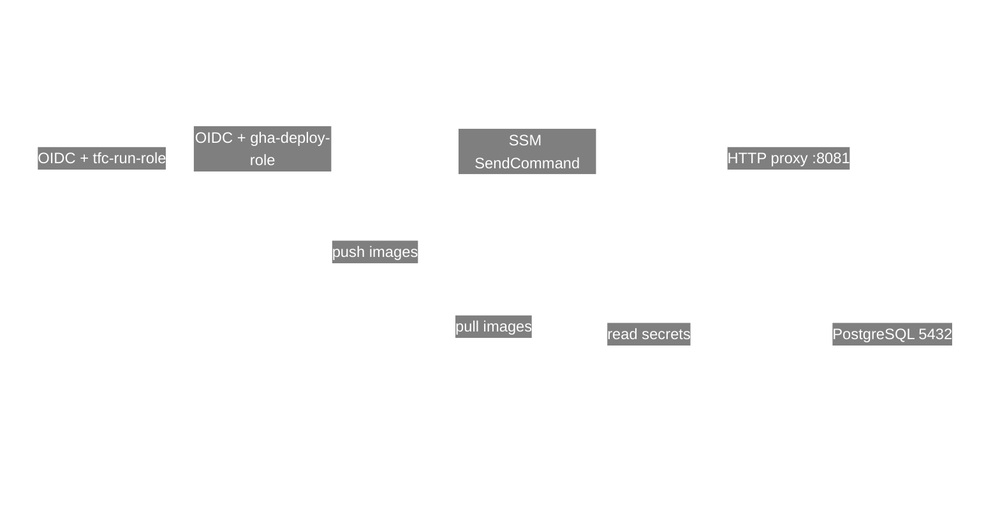

# INFRA_VIEW — Understand the Infrastructure

This view is intentionally split into four layers. Read them in order: **Big Picture → AWS → Identity / Deployment → Terraform Map**.

The detailed resource names, Terraform resource types, source files, usage relationships, and purposes are retained below, but are separated so that the architecture can be understood progressively.

---

# 1. Big Picture — How everything works



### The story in plain English

1. **Terraform Cloud** runs the infrastructure Terraform. It authenticates to AWS through the Terraform Cloud OIDC trust and `tfc-run-role` established by the bootstrap configuration.
2. **GitHub Actions** builds the application images, pushes them to ECR, and uses AWS Systems Manager (SSM) to deploy/run commands on the EC2 host. It authenticates through the GitHub OIDC trust and `gha-deploy-role`.
3. **API Gateway** is the public HTTP entry point and proxies requests to the EC2 host on port `8081`.
4. **EC2** hosts the application containers. Its instance role lets it pull the two ECR images and read the required SSM parameters.
5. **EC2** connects to the private PostgreSQL RDS instance on port `5432`.
6. **RDS** receives its master password from Terraform-generated `random_password` data stored as an SSM SecureString.

---

# 2. AWS Infrastructure — What exists

```mermaid
%%{init: {"theme":"base","themeVariables":{"fontFamily":"Arial","fontSize":"20px","primaryColor":"transparent","primaryTextColor":"white","primaryBorderColor":"white","lineColor":"white","edgeLabelBackground":"transparent"},"flowchart":{"nodeSpacing":45,"rankSpacing":70,"padding":20}}}%%
flowchart TB
    subgraph VPC["VPC — enterprise_network — 10.0.0.0/16"]
        direction TB
        API["API Gateway\neai-project-http-api\nHTTP_PROXY → EC2:8081"]
        IGW["Internet Gateway\nenterprise_igw"]
        RT["Public Route Table\npublic_rt\n0.0.0.0/0 → IGW"]
        ASSOC["Route Table Association\npublic_rt_assoc"]

        subgraph APP["Application Network"]
            direction TB
            S1["Subnet 1\nsubnet-1\n10.0.1.0/24 · ap-south-1a\npublic IP mapping"]
            SG["App Security Group\napp_sg / eai-app-sg\nTCP 8081 from 0.0.0.0/0"]
            PROF["Instance Profile\nec2_profile / eai-ec2-instance-profile"]
            EC2["EC2\nsandbox-1 / eai-project-host\nt3.micro"]
            ECRJ["ECR\neai-java-gateway"]
            ECRP["ECR\neai-python-validator"]
        end

        subgraph DATA["Database Network"]
            direction TB
            S2["Subnet 2\nsubnet-2\n10.0.2.0/24 · ap-south-1b"]
            DBSUB["RDS Subnet Group\nrds_subnet_group / eai-rds-subnet-group\nsubnet-1 + subnet-2"]
            DBSG["DB Security Group\ndb_sg / eai-db-sg\nTCP 5432 from app_sg"]
            RDS["RDS PostgreSQL 16\nsmart_meter_db / eai-smart-meter-db\nsmart_meter_warehouse"]
        end

        SSM["SSM SecureString parameters\n/eai-project/rds/master_password\n/eai-project/api/security_token"]
    end

    API -->|ANY proxy route| EC2
    IGW --> RT
    RT --> ASSOC
    ASSOC --> S1
    S1 --> EC2
    SG --> EC2
    PROF --> EC2
    ECRJ -->|image pulled by EC2| EC2
    ECRP -->|image pulled by EC2| EC2
    S1 --> DBSUB
    S2 --> DBSUB
    DBSUB --> RDS
    DBSG --> RDS
    EC2 -->|5432| RDS
    SSM -->|secrets read by EC2| EC2
```

## Important network fact

`public_rt_assoc` associates **only `subnet-1`** with `public_rt`. `subnet-2` has no route-table association defined here. Both subnets are nevertheless members of the RDS subnet group.

## AWS resource inventory

| AWS entity | Terraform resource | AWS name / identifier | Defined in | Used by / relationship | Purpose |
|---|---|---|---|---|---|
| VPC | `aws_vpc.enterprise_network` | `Primary-Enterprise-VPC` | `eai-project.tf` | Subnets, IGW, route table, SGs | Network boundary `10.0.0.0/16` |
| Subnet | `aws_subnet.subnet-1` | `Primary-Subnet-1` | `eai-project.tf` | EC2, RDS subnet group, route association | Public application subnet |
| Subnet | `aws_subnet.subnet-2` | `Primary-Subnet-2` | `networking.tf` | RDS subnet group | Second AZ subnet |
| Internet Gateway | `aws_internet_gateway.enterprise_igw` | `Primary-Enterprise-IGW` | `eai-project.tf` | `public_rt` | Internet connectivity |
| Route table | `aws_route_table.public_rt` | `Primary-Public-Route-Table` | `eai-project.tf` | `public_rt_assoc` | Default route to IGW |
| Route association | `aws_route_table_association.public_rt_assoc` | — | `eai-project.tf` | `subnet-1` | Makes subnet-1 use public route table |
| App SG | `aws_security_group.app_sg` | `eai-app-sg` | `eai-project.tf` | EC2; referenced by DB SG | Allows TCP 8081 inbound; all outbound |
| EC2 | `aws_instance.sandbox-1` | `eai-project-host` | `eai-project.tf` | API Gateway, ECR, SSM, RDS | Runs application containers |
| Instance profile | `aws_iam_instance_profile.ec2_profile` | `eai-ec2-instance-profile` | `iam-ec2.tf` | EC2 | Delivers EC2 role credentials |
| ECR | `aws_ecr_repository.java_gateway` | `eai-java-gateway` | `ecr.tf` | GitHub Actions pushes; EC2 pulls | Java image registry |
| ECR | `aws_ecr_repository.python_validator` | `eai-python-validator` | `ecr.tf` | GitHub Actions pushes; EC2 pulls | Python image registry |
| DB SG | `aws_security_group.db_sg` | `eai-db-sg` | `rds.tf` | RDS | Allows PostgreSQL only from app SG |
| DB subnet group | `aws_db_subnet_group.rds_subnet_group` | `eai-rds-subnet-group` | `rds.tf` | RDS | Supplies subnets for RDS |
| RDS | `aws_db_instance.smart_meter_db` | `eai-smart-meter-db` | `rds.tf` | EC2 | PostgreSQL 16 database |
| API | `aws_apigatewayv2_api.eai_http_api` | `eai-project-http-api` | `api-gateway.tf` | Clients → EC2 | Public HTTP front door |
| API integration | `aws_apigatewayv2_integration.java_gateway` | — | `api-gateway.tf` | API → EC2 public IP `:8081` | HTTP proxy |
| API route | `aws_apigatewayv2_route.proxy_route` | `ANY /{proxy+}` | `api-gateway.tf` | API | Forwards all paths/methods |
| API stage | `aws_apigatewayv2_stage.default` | `$default` | `api-gateway.tf` | API | Auto deploy + throttling |

---

# 3. Identity / Deployment — Who can do what

```mermaid
%%{init: {"theme":"base","themeVariables":{"fontFamily":"Arial","fontSize":"20px","primaryColor":"transparent","primaryTextColor":"white","primaryBorderColor":"white","lineColor":"white","edgeLabelBackground":"transparent"},"flowchart":{"nodeSpacing":70,"rankSpacing":100,"padding":20}}}%%
flowchart TB
    BOOT["BOOTSTRAP\n/bootstrap/main.tf"]
    GOIDC["GitHub OIDC Provider\ntoken.actions.githubusercontent.com"]
    GROLE["IAM Role\ngha_deploy\nAWS: gha-deploy-role"]
    GPOL["Inline IAM Policy\ngha_deploy\nAWS: gha-deploy-permissions\nDefined in /infra/iam-gha.tf"]
    GHA["GitHub Actions"]
    TOIDC["Terraform Cloud OIDC Provider\napp.terraform.io"]
    TROLE["IAM Role\ntfc_run\nAWS: tfc-run-role"]
    TFC["Terraform Cloud\nMyOtg / eai-project-infra"]
    EC2ROLE["IAM Role\nec2_instance_role\nAWS: eai-ec2-instance-role"]
    EC2POL["Inline Runtime Policy\nec2_runtime\nAWS: ec2-runtime-permissions"]
    SSMCORE["Managed Policy Attachment\nAmazonSSMManagedInstanceCore"]
    EC2["EC2\neai-project-host"]
    ECR["ECR Java + Python"]
    SSM["SSM Parameters"]
    CMD["SSM SendCommand"]

    BOOT --> GOIDC
    BOOT --> TOIDC
    GOIDC --> GROLE
    TOIDC --> TROLE
    GROLE --> GPOL
    GHA -->|OIDC assume role| GROLE
    TFC -->|OIDC workload identity| TROLE
    GHA -->|push images| ECR
    GHA -->|SendCommand + invocation lookup| CMD
    CMD --> EC2
    EC2 --> EC2ROLE
    EC2ROLE --> EC2POL
    EC2ROLE --> SSMCORE
    EC2POL --> ECR
    EC2POL --> SSM

    subgraph LEGEND[Legend]
        L1[White = OIDC / IAM trust identity]
        L2[Blue = Bootstrap / operational resources]
    end

    classDef boundary fill:transparent,stroke:white,color:white
    class GOIDC,GROLE,TOIDC,TROLE,L1 boundary
```

## The crucial IAM distinction

**`gha_deploy` appears twice, but it is not two roles.**

- `/infra/bootstrap/main.tf` → `aws_iam_role.gha_deploy` → **creates** AWS IAM role `gha-deploy-role`.
- `/infra/iam-gha.tf` → `aws_iam_role_policy.gha_deploy` → **adds an inline policy** named `gha-deploy-permissions` to that already-existing role by its hard-coded AWS role name.
- These are separate Terraform roots/states. The normal `/infra` configuration does **not** have a Terraform resource reference to the bootstrap role.

### GitHub Actions permissions

`gha-deploy-permissions` grants:

- `ecr:GetAuthorizationToken` on `*`
- ECR push actions on both application repositories
- `ssm:SendCommand` using the `AWS-RunShellScript` document
- `ssm:SendCommand` against EC2 instances tagged `Name=eai-project-host`
- `ssm:GetCommandInvocation` and `ec2:DescribeInstances` on `*`

### EC2 runtime permissions

`ec2-runtime-permissions` grants:

- ECR authentication on `*`
- ECR pull actions on the Java and Python repositories
- `ssm:GetParameter` for the RDS password and API security token
- `kms:Decrypt` for `alias/aws/ssm`

The separate `AmazonSSMManagedInstanceCore` managed policy enables SSM management of the EC2 instance.

### Terraform Cloud identity

Bootstrap creates the Terraform Cloud OIDC provider and `tfc-run-role`. The trust condition is scoped to:

`organization:MyOtg:project:*:workspace:eai-project-infra:run_phase:*`

The `/infra/main.tf` file declares the Terraform Cloud organization/workspace and Terraform/provider requirements. It should not be interpreted as directly referencing the bootstrap IAM role resource.

---

# 4. Terraform Map — Where is everything defined?

```mermaid
%%{init: {"theme":"base","themeVariables":{"fontFamily":"Arial","fontSize":"20px","primaryColor":"transparent","primaryTextColor":"white","primaryBorderColor":"white","lineColor":"white","edgeLabelBackground":"transparent"},"flowchart":{"nodeSpacing":60,"rankSpacing":75,"padding":20}}}%%
flowchart TB
    B["/infra/bootstrap/main.tf\nONE-TIME BOOTSTRAP"]
    M["/infra/main.tf\nTerraform Cloud + provider requirements"]
    E["/infra/eai-project.tf\nCore network + EC2"]
    N["/infra/networking.tf\nSecond subnet"]
    I["/infra/iam-ec2.tf\nEC2 identity"]
    G["/infra/iam-gha.tf\nGitHub deployment policy"]
    R["/infra/rds.tf\nDatabase + secrets"]
    C["/infra/ecr.tf\nContainer registries"]
    A["/infra/api-gateway.tf\nPublic API"]

    B -->|creates trust foundation| G
    M --> E
    E --> I
    E --> R
    E --> A
    N --> R
    I --> E
    G --> B
    C --> G
    C --> I
    R --> I
    A --> E
```

## File-by-file map

### `/infra/bootstrap/main.tf` — one-time trust foundation

| Terraform entity | Type | AWS resource/name | Used by | Purpose |
|---|---|---|---|---|
| `github` | `aws_iam_openid_connect_provider` | GitHub OIDC provider | `gha_deploy` trust | Allows GitHub Actions OIDC authentication |
| `gha_trust` | `data.aws_iam_policy_document` | Policy definition only | `gha_deploy` | Restricts GitHub OIDC subjects/audience |
| `gha_deploy` | `aws_iam_role` | `gha-deploy-role` | GitHub Actions + `/infra/iam-gha.tf` | Deployment identity |
| `tfc` | `aws_iam_openid_connect_provider` | Terraform Cloud OIDC provider | `tfc_run` trust | Allows TFC workload identity |
| `tfc_trust` | `data.aws_iam_policy_document` | Policy definition only | `tfc_run` | Restricts TFC workspace/run phase |
| `tfc_run` | `aws_iam_role` | `tfc-run-role` | Terraform Cloud | Infrastructure execution identity |

### `/infra/main.tf` — Terraform control plane

- Terraform Cloud organization: `MyOtg`
- Workspace: `eai-project-infra`
- Terraform version constraint: `>= 1.5`
- AWS provider constraint: `~> 6.0`
- The AWS provider region is configured in `eai-project.tf` as `ap-south-1`.
- Terraform merges these declarations across `.tf` files; the files are not executed independently.

### `/infra/eai-project.tf` — core network and compute

- `aws_vpc.enterprise_network`
- `aws_subnet.subnet-1`
- `aws_internet_gateway.enterprise_igw`
- `aws_route_table.public_rt`
- `aws_route_table_association.public_rt_assoc`
- `aws_security_group.app_sg`
- `data.aws_ami.amazon_linux`
- `aws_instance.sandbox-1`
- Outputs: `instance_public_ip`, `instance_id`

### `/infra/networking.tf` — additional subnet

- `aws_subnet.subnet-2`
- CIDR `10.0.2.0/24`
- AZ `ap-south-1b`
- VPC: `enterprise_network`

### `/infra/iam-ec2.tf` — EC2 identity

- `data.aws_iam_policy_document.ec2_trust` — EC2 service trust definition
- `aws_iam_role.ec2_instance_role` — `eai-ec2-instance-role`
- `aws_iam_role_policy_attachment.ssm_core` — `AmazonSSMManagedInstanceCore`
- `data.aws_iam_policy_document.ec2_runtime_permissions` — runtime permission definition
- `aws_iam_role_policy.ec2_runtime` — `ec2-runtime-permissions`
- `aws_iam_instance_profile.ec2_profile` — `eai-ec2-instance-profile`

### `/infra/iam-gha.tf` — GitHub deployment permissions

- `data.aws_iam_policy_document.gha_permissions` — ECR + SSM deployment permissions
- `aws_iam_role_policy.gha_deploy` — `gha-deploy-permissions`
- **Target role:** hard-coded AWS role name `gha-deploy-role` created by bootstrap.

### `/infra/ecr.tf` — container registries

- `aws_ecr_repository.java_gateway` — `eai-java-gateway`
- `aws_ecr_repository.python_validator` — `eai-python-validator`
- Both repositories are immutable and scan on push.
- Lifecycle policies retain the last 10 images for each repository.

### `/infra/rds.tf` — database and secrets

- `random_password.rds_master` — generates 24-character master password; special characters disabled.
- `aws_ssm_parameter.rds_password` — SecureString `/eai-project/rds/master_password`.
- `aws_ssm_parameter.api_security_token` — SecureString `/eai-project/api/security_token`.
- `aws_db_subnet_group.rds_subnet_group` — `eai-rds-subnet-group`, using subnet-1 + subnet-2.
- `aws_security_group.db_sg` — `eai-db-sg`, PostgreSQL 5432 only from `app_sg`.
- `aws_db_instance.smart_meter_db` — `eai-smart-meter-db`, PostgreSQL 16, `db.t4g.micro`, 20 GB, DB `smart_meter_warehouse`, user `smart_meter_admin`, private, Multi-AZ false, backup retention 1, skip final snapshot true.
- Output: `rds_endpoint`.

### `/infra/api-gateway.tf` — public API entry point

- `aws_apigatewayv2_api.eai_http_api` — `eai-project-http-api`, HTTP API.
- `aws_apigatewayv2_integration.java_gateway` — HTTP proxy `ANY`, target `http://${aws_instance.sandbox-1.public_ip}:8081/{proxy}`.
- `aws_apigatewayv2_route.proxy_route` — `ANY /{proxy+}`.
- `aws_apigatewayv2_stage.default` — `$default`, auto-deploy, throttle burst `20`, rate `10`.
- Output: API endpoint.

---

# 5. End-to-end flows

### Infrastructure provisioning

```text
Terraform Cloud
    ↓ OIDC
tfc-run-role
    ↓
AWS infrastructure
    ├── VPC / subnets / routing / security groups
    ├── EC2 + instance profile
    ├── ECR repositories
    ├── RDS + subnet group + DB security group
    └── API Gateway
```

### Application deployment

```text
GitHub Actions
    ↓ GitHub OIDC
gha-deploy-role
    ↓
    ├── Push Java image ───────→ ECR eai-java-gateway
    ├── Push Python image ──────→ ECR eai-python-validator
    └── SSM SendCommand ────────→ EC2 eai-project-host
                                      ↓
                                  Pull images from ECR
                                      ↓
                                  Run containers
```

### Runtime request/data flow

```text
Client
  ↓
API Gateway
  ↓ HTTP :8081
EC2 application
  ├──→ SSM Parameter Store (secrets)
  └──→ RDS PostgreSQL :5432
```

---

# 6. Things that are easy to misunderstand

1. **Bootstrap is separate from normal infrastructure.** `/infra/bootstrap/main.tf` is a separate Terraform root/state used to establish OIDC providers and the two IAM roles.
2. **`gha_deploy` is not two IAM roles.** One Terraform resource creates the role; another Terraform resource adds an inline policy to it.
3. **Terraform Cloud does not equal AWS.** TFC is the execution/control plane; AWS contains the infrastructure.
4. **The API Gateway does not run the application.** It proxies requests to the EC2 public IP on port `8081`.
5. **EC2 does not contain long-lived AWS credentials.** Its permissions arrive through the instance profile/role.
6. **The DB is protected by a different security group.** `db_sg` permits PostgreSQL only from `app_sg`.
7. **Only subnet-1 is associated with the public route table.** Subnet-2 is not associated with `public_rt` in the supplied Terraform.
8. **RDS uses both subnets.** The DB subnet group contains subnet-1 and subnet-2.
9. **ECR has two separate repositories.** One is for the Java gateway and one for the Python validator.
10. **Data sources and policy documents are not AWS resources.** They are Terraform-side inputs/definitions used to construct resources or policies.
